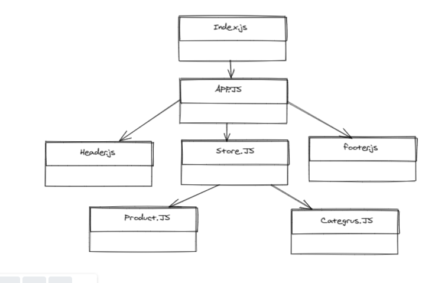

##  Deployment Test
- [Netlify](https://deploy-preview-3--suspicious-austin-c810f7.netlify.app/) 
- [pull request 3 ](https://github.com/MohammadAljadayh/storeRedux/pull/3).
- [pull request 4 ](https://github.com/MohammadAljadayh/storeRedux/pull/4).
- [Main Repo link](https://github.com/MohammadAljadayh/storeRedux) 

## RUN Project
 you can run:
 `npm run start`
- localhost=3000

### `npm run test`

## UML 

